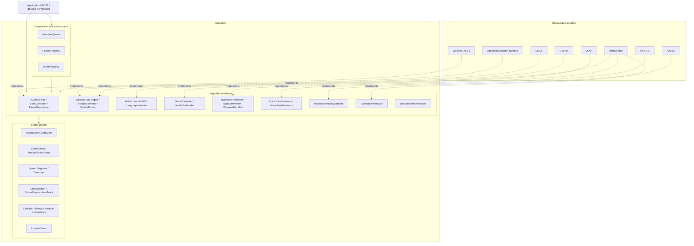
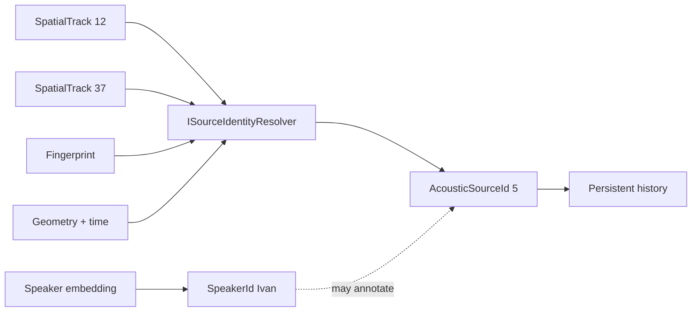
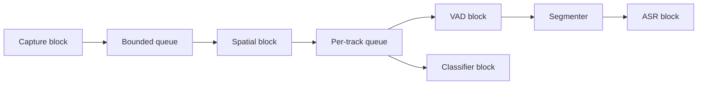

# Architecture

The dependency rule is: **core owns abstractions, backends implement them,
pipelines depend on abstractions, applications compose blocks**.

Authoritative Mermaid source: `docs/images/architecture.mmd`.

## Source identity

A persistent acoustic source is generic; speaker identity is optional evidence,
not the definition of a source.

## Application-controlled scheduling

The diagram is a possible application graph, not an internal mandatory thread
layout. The same blocks may be called synchronously in an offline program.
