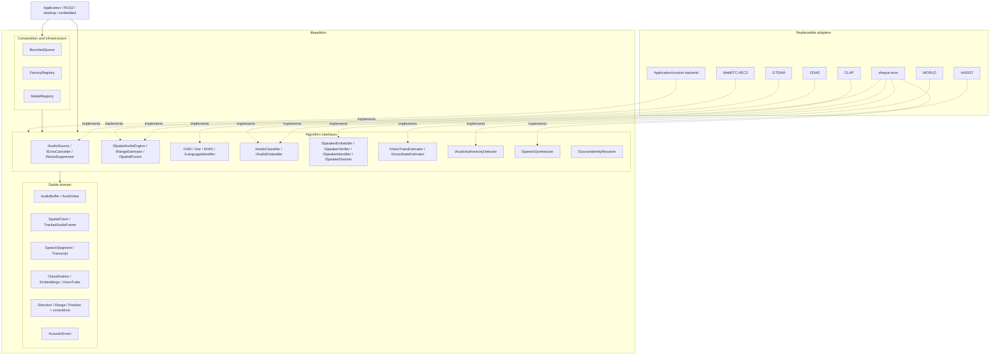
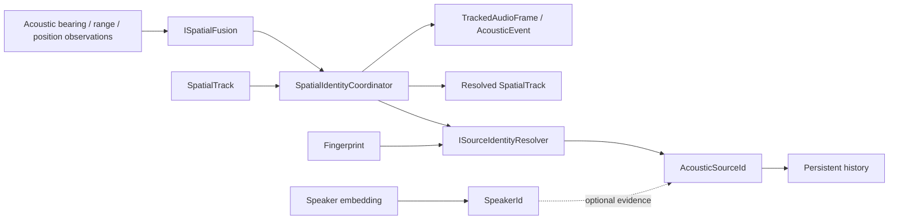
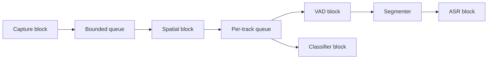
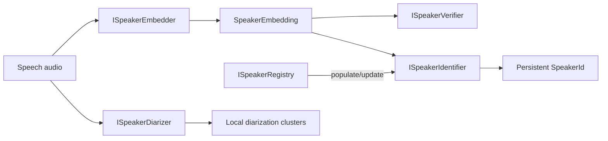

# Architecture

The dependency rule is: **core owns abstractions, backends implement them,
pipelines depend on abstractions, applications compose blocks**.

Authoritative Mermaid source: `docs/images/architecture.mmd`.

## Project boundary

`libaudition` ends at acoustic-domain outputs: audio-derived direction, range,
position, source identity, classification, speech, voice measurements, and
`AcousticEvent`.

Robot/system integration belongs above this library. In the intended
`audio_nav2` consumer, camera/OAK-D data, radar, odometry, TF, robot state,
cross-modal association/fusion, and ROS 2/Nav2 behavior remain application
responsibilities. Non-audio sensor provenance must therefore not be added to
libaudition spatial enums or backend contracts.

## Source identity

A persistent acoustic source is generic; speaker identity is optional evidence,
not the definition of a source. `SpatialIdentityCoordinator` is a composition
helper rather than a new inference backend: applications still choose the
`ISpatialFusion` and `ISourceIdentityResolver` implementations explicitly.

## Application-controlled scheduling

The diagram is a possible application graph, not an internal mandatory thread
layout. The same blocks may be called synchronously in an offline program.

## Speaker identity layers

The diarizer's cluster index is local evidence. The identification index is
rebuildable computational state. Persistent identity lives in the registry.
