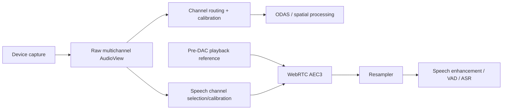

# Audio frontend, resampling, and echo cancellation

The audio frontend is an explicit pipeline layer between device capture and
algorithm backends. It does not own ALSA/Pulse/ROS scheduling and it never
silently changes an `AudioView`.

## Recommended branch topology



Authoritative Mermaid source: `docs/images/audio_frontend.mmd`.

The spatial branch and speech branch deliberately diverge. Speech-oriented AEC,
noise suppression, and enhancement can alter inter-channel phase and therefore
must not be inserted into the microphone-array path by default.

## Channel routing and calibration

`dsp::AudioFrontend` produces one output channel per `ChannelRoute`.
Each route selects an input channel and applies:

```text
y[n] = gain * (x[n - delay_samples] - dc_offset)
```

`delay_samples` may be fractional and is implemented with first-order linear
interpolation. State is retained across calls, so block boundaries do not reset
the delay line. `reset()` clears that history and the locked input format.

Only non-negative delays are accepted: array calibration should choose a common
reference and delay early channels to it rather than inventing future samples.

For the known ReSpeaker 4-Mic USB Array v2.0 six-channel capture layout, the
four physical microphone channels are selected with zero-based indices:

```cpp
config.routes = {
    {1, mic0_calibration},
    {2, mic1_calibration},
    {3, mic2_calibration},
    {4, mic3_calibration},
};
```

This mapping is a device profile, not a hard-coded library assumption.

For precision array work, calibration coefficients should come from measurement.
The current linear fractional-delay interpolator is a lightweight frontend
primitive; a higher-order fractional-delay/FIR calibration block can be added
later without changing the routing contract.

## Quality metrics

`dsp::analyzeQuality()` reports values that can be measured directly from the
samples:

- RMS and RMS dBFS;
- absolute peak and peak dBFS;
- DC offset;
- crest factor;
- clipping ratio;
- per-channel copies of the same metrics.

SNR is intentionally separate. `dsp::snrDb(signal_rms, noise_rms)` requires an
explicit measured/estimated noise RMS. The library does not infer a trustworthy
noise floor from an arbitrary single frame.

### SPL calibration

`SignalMetrics::rms_dbfs` remains a digital level. To convert it to physical
sound-pressure level, use an explicit `SoundPressureCalibrationProfile` and
`SoundPressureLevelCalibrator`.

A profile records the SPL of a reference calibrator/source and the dBFS measured
through the exact digital signal path being calibrated. For example, if a
94 dB SPL / 1 kHz reference produces -26 dBFS RMS, the resulting calibration
offset is +120 dB.

The `signal_path_id` is deliberately opaque but mandatory. It should identify
the complete capture path relevant to level, for example:

```text
respeaker_usb_v2.capture -> frontend.route.0 -> unity_post_gain
```

Changing microphone gain, frontend gain, routing, EQ, AGC, normalization, or any
other level-changing processing invalidates that profile unless the same change
was part of the calibrated path.

The helper does not apply A- or C-weighting filters. A/C/Z is metadata checked
between the calibration profile and observation; if weighted SPL is required,
the corresponding weighting filter must be applied before the dBFS measurement
and included in the named calibrated signal path.

Exact digital silence produces `-inf dBFS`; calibration returns no
`SoundLevelObservation` rather than inventing a finite acoustic noise floor.

## Noise suppression lifecycle

`INoiseSuppressorSession` is a stateful stream contract. `process()` may return
fewer samples than it receives when a backend buffers algorithmic context.
`flush()` returns any remaining output and ends the current stream; call
`reset()` before reusing that session afterwards.

`INoiseSuppressor::capabilities()` reports whether a backend is streaming, its
accepted audio requirements and execution targets. Streaming backends can expose
a `preferred_frame_count` without requiring callers to use exactly that chunk
size.

## libsamplerate backend

`SamplerateResampler` implements `IAudioResampler` with a stateful streaming
session over libsamplerate. It supports planar and interleaved libaudition
buffers, preserves channel count, exposes `reset()` and `flush()`, and keeps
the output timeline continuous.

The backend is optional:

```bash
-DLIBAUDITION_WITH_LIBSAMPLERATE=ON
```

When no compatible system package is found and dependency fetching is allowed,
the build uses the pinned 0.2.2 source revision.

## WebRTC AEC3 backend

`WebRtcAec3EchoCanceller` implements `IEchoCanceller`.

The reference passed to `acceptReference()` must represent the signal sent
toward the robot loudspeaker as close as practical to the pre-DAC/playback
stream. Using microphone audio as the reference defeats the purpose of
reference-based acoustic echo cancellation.

The current adapter:

- accepts 16, 32, or 48 kHz sessions;
- requires capture and reference to use the same sample rate;
- processes exactly 10 ms frames;
- permits different render and capture channel counts;
- accepts explicit stream delay through `setStreamDelay()`;
- exposes one-shot `notifyEchoPathGainChange()`;
- reports backend ERL, ERLE and estimated delay when available;
- creates no application scheduler threads.

The standalone AEC3 extraction is C++20 internally, but it is isolated behind a
shared backend library so libaudition consumers continue to compile as C++17.

Enable it with:

```bash
-DLIBAUDITION_WITH_WEBRTC_AEC3=ON
```

## Real-time ownership

All blocks remain caller-scheduled. A typical application may run capture,
spatial processing and speech processing in different workers with bounded
queues, but libaudition does not impose those workers.

An `AudioFrontend`, resampler session, or AEC session is stateful and should be
owned by one stream/executor unless the application provides external
synchronization.
