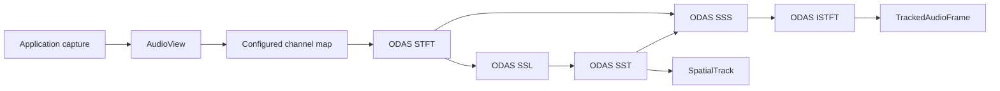

# Direct ODAS backend

`audition::OdasSpatialEngine` is the first concrete spatial-audio backend in
`libaudition`. It adapts the MIT-licensed `libodas` C API directly; it does not
use `odas_ros`, sockets, `odaslive`, or an audio-device abstraction.

## Boundary

The backend implements `ISpatialAudioEngine` and owns only ODAS algorithm state.
The application remains responsible for capture, scheduling, buffering,
backpressure, thread placement, and real-time policy.



Authoritative diagram source: `docs/images/odas_pipeline.mmd`.

## Input contract

`process()` consumes exactly one configured ODAS hop. The backend accepts both
interleaved and planar `AudioView` layouts and selects physical input channels
through `OdasOptions::input_channels`.

For example, the upstream ReSpeaker USB 4 Mic Array v2.0 configuration captures
six channels but maps microphone channels 2, 3, 4 and 5 in ODAS' one-based
configuration syntax. In `libaudition` zero-based channel indices are therefore:

```cpp
options.input_channels = {1, 2, 3, 4};
```

No ALSA device name is stored in the backend.

## Track-to-separated-audio mapping

This mapping is deliberately slot based.

ODAS SST owns a fixed array of `nTracksMax` slots and writes the track ID,
XYZ unit vector and activity to the same `iTrackMax` index. ODAS SSS constructs
its separation outputs using that same fixed track count and the same `tracks`
message. Consequently:

> ODAS SSS output channel/slot `i` belongs to ODAS SST track slot `i`.

The adapter reads `tracks.ids[i]` and attaches SSS channel `i` to the resulting
`SpatialTrackId`. It never compacts active tracks first and never assumes that
"the Nth active source" is equivalent to channel N.

## Geometry and coordinates

Microphone positions and directions are supplied through
`MicrophoneArrayGeometry` in the `libaudition` sensor-frame convention:
right-handed, +X forward, +Y left, +Z up, meters/radians. The adapter copies
that geometry into ODAS; it does not apply a hidden rotation.

ODAS SST reports a tracked unit direction, not a metric source position.
`OdasSpatialEngine` therefore fills `SpatialTrack::direction` only. Range and
position remain unset until another estimator/fusion backend provides them.

ODAS does not expose a calibrated angular covariance for SST. Accordingly,
`DirectionEstimate::angular_variance_rad2` is `std::nullopt` and direction
`confidence` is left at `0` rather than inventing certainty. ODAS activity is
kept separately as `SpatialTrack::activity`.

## Separation modes

The pinned ODAS revision supports the processing paths used by this adapter:

- delay-and-sum (`DDS`),
- geometric source separation (`DGSS`),
- multi-source or single-source post-filtering.

Although the upstream configuration parser mentions `DMVDR`, the pinned
`mod_sss_process()` implementation does not implement that mode, so
`libaudition` intentionally does not expose it.

The default output is the separated, pre-speech-postfilter stream. Applications
that specifically want ODAS post-filtered speech can select
`OdasSeparatedOutput::Postfiltered`.

## State and reset

The ODAS modules are stateful. One `OdasSpatialEngine` instance is
instance-confined and must not receive concurrent `process()`/`reset()` calls.
The backend creates no worker threads.

ODAS exposes no complete reset operation, therefore `reset()` destroys and
reconstructs the internal module graph. Applications must treat reset as a
non-real-time operation.

`SpatialTrackId` is derived from the ODAS tracker ID. The adapter preserves a
`first_seen` timestamp for that ID while ODAS keeps it alive. Persistent
`AcousticSourceId` assignment is intentionally a later, backend-independent
identity step.

## Configuration safety

`validateOdasOptions()` rejects invalid inputs before constructing ODAS state.
It also enforces `ssl.potential_source_count >= ssl.scan_levels.size()` because
the pinned ODAS `mod_ssl_construct()` allocates one internal pointer array by
potential-source count and initializes it by scan-level count.

ODAS is a C library and some upstream internal error paths still call `exit()`.
The adapter validates all supported configuration combinations that it can
reasonably guard, but cannot transform an unexpected internal ODAS fatal path
into a C++ exception without forking ODAS.

## Building

With a system ODAS installation:

```bash
cmake -S . -B build   -DLIBAUDITION_WITH_ODAS=ON   -DLIBAUDITION_FETCH_DEPENDENCIES=OFF
cmake --build build
```

Or allow `libaudition` to fetch the exact audited revision:

```bash
cmake -S . -B build -DLIBAUDITION_WITH_ODAS=ON
cmake --build build
```

The fetched revision is pinned in `cmake/Dependencies.cmake`. When fetched,
ODAS is installed alongside `libaudition` so an installed
`audition::backend_odas` target remains usable.

The public backend headers contain no ODAS declarations; all C API details are
hidden behind PImpl.
